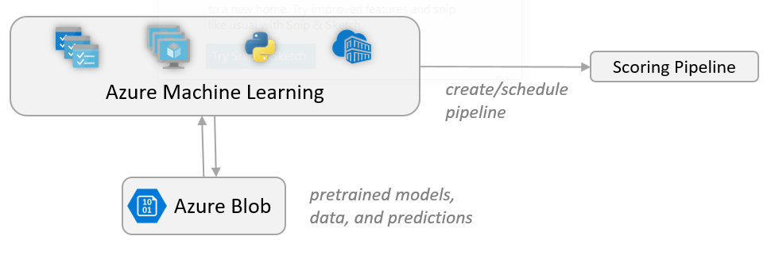

### Author: Said Bleik

# Deploying a Batch Scoring Pipeline for Python Models

## Overview
#### Scoring Anomaly Detection Models at Scale using Batch AI
In this repository you will find a set of scripts and commands that help you build a scalable solution for scoring many models in parallel using Batch AI.

The solution can be used as a template and can generalize to different problems. The problem addressed here is monitoring the operation of a large number of devices in an IoT setting, where each device sends sensor readings continuously. We assume there are pre-trained [anomaly detection models](http://scikit-learn.org/stable/modules/outlier_detection.html#outlier-detection) (one for each device) that need to be used to predict whether a series of measurements, that are aggregated over a predefined time interval, correspond to an anomaly or not.

To get started, read through the *Architecture* section, then go through the following sections:
    
* Install Prerequisites
* Create Environment
* Create Azure Resources
* Validate Deployments and Jobs Execution
* Cleanup

## Design


This solution consists of several Azure cloud services that allow upscaling and downscaling resources according to need. The services and their role in this solution are described below.

### Blob Storage
Blob containers are used to store the pre-trained models, the data, and the output predictions. The models that we upload to blob storage in the [*create_resources.ipynb*](create_resources.ipynb) notebook are [One-class SVM](http://scikit-learn.org/stable/modules/generated/sklearn.svm.OneClassSVM.html) models that are trained on data that represents values of different sensors of different devices. We assume that the data values are aggregated over a fixed interval of time. In real-world scenarios, this could be a stream of sensor readings that need to be filtered and aggregated before being used in training or real-time scoring. For simplicity, we use the same data file when executing scoring jobs.

### Batch AI
Batch AI is the distributed computing engine used here. It allows spinning up virtual machines on demand with an auto-scaling option, where each node in the Batch AI cluster runs a scoring job for a specific sensor. The scoring Python [script](batchai/predict.py) is run in Docker containers that are created on each node of the cluster.

### Logic Apps
Logic Apps provide an easy way to create the runtime workflow and scheduling for the solution. In our case, we create a Logic App that runs hourly Batch AI jobs. The jobs are submitted using a Python [script](sched/submit_jobs.py) that also runs in a Docker container.

### Container Registry
The Docker images used in both Batch AI and Logic Apps are created in the [*create_resources.ipynb*](create_resources.ipynb) notebook and pushed to an Azure Container Registry (ACR). ACR provides a convenient way to host images and instantiate containers through other Azure services.


> For more information on these services, check the documentation links provided in the *Links* section. 

## Prerequisites
- [conda 4.5](https://conda.io/docs/user-guide/install/index.html)
- [Docker](https://www.docker.com/)
- [jq](https://stedolan.github.io/jq/) - *sudo apt-get install jq*


> *All scripts and commands were tested on an Ubuntu 16.04 LTS system.*

## Setup
Once all prerequisites are installed,
1. Add the current user to the docker group

    ```
    sudo usermod -a -G docker $USER
    ```
   
2. Log out and log in again or restart your machine

3. Clone or download this repsitory:

    ```
    git clone https://github.com/Azure/BatchAIAnomalyDetection.git
    ```
4. Create and select conda environment from yml file:
        
    ``` 
    conda env create -f environment.yml
    conda activate baimm    
    ```
5. Start Jupyter in the same environment:
    
    ```
    jupyter notebook
    ```
6. Open Jupyter Notebook in your browser and select the environemnt kernel in the menu: 

    ```
    Kernel > Change Kernel > Python [conda env:baimm]
    ```

Start creating the required resources in the next section.

## Steps
### 1. Create Azure Resources
The [create_resources.ipynb](create_resources.ipynb) notebook contains all Azure CLI and Docker commands needed to create resources in your Azure subscription, as well as configurations of Batch AI and scoring Python scripts. 

Navigate to the cloned/downloaded directory in Jupyter Notebook: *BatchAIAnomalyDetection/create_resources.ipynb*, and start executing the cells to create the needed Azure resources.


### 2. Validate Deployments and Jobs Execution 
After all resources are created, you can check your resource group in the portal and validate that all components have been deployed successfully. 

Under *Batch AI Workspace > Cluster > Jobs*, you should see the experiment and scoring jobs, as soon as the Logic App is triggered. It might take a few minutes for ACI to pull the scheduling image and run the container and for the Batch AI cluster to resize and allocate nodes before running the jobs.

Under *Storage Account > Blobs*, you should see the predictions CSV files in the *predictions* container, after the Batch AI jobs finish successfully.


## Cleaning up
If you wish to delete all created resources, run the following CLI command to delete the resource group and all underlying resources.

```sh
az group delete --name <resource_group_name>
```

## Links
- [End-to-End Anomaly Detection Jobs using Azure Batch AI](https://github.com/saidbleik/batchai_mm_ad)
- [Batch AI Documentation](https://docs.microsoft.com/en-us/azure/batch-ai/)
- [Logic Apps Documentation](https://docs.microsoft.com/en-us/azure/logic-apps/)
- [Azure Blob Storage Documentation](https://docs.microsoft.com/en-us/azure/storage/blobs/storage-blobs-introduction)

## Contributing
This project welcomes contributions and suggestions.  Most contributions require you to agree to a
Contributor License Agreement (CLA) declaring that you have the right to, and actually do, grant us
the rights to use your contribution. For details, visit https://cla.microsoft.com.

When you submit a pull request, a CLA-bot will automatically determine whether you need to provide
a CLA and decorate the PR appropriately (e.g., label, comment). Simply follow the instructions
provided by the bot. You will only need to do this once across all repos using our CLA.

This project has adopted the [Microsoft Open Source Code of Conduct](https://opensource.microsoft.com/codeofconduct/).
For more information see the [Code of Conduct FAQ](https://opensource.microsoft.com/codeofconduct/faq/) or
contact [opencode@microsoft.com](mailto:opencode@microsoft.com) with any additional questions or comments.
